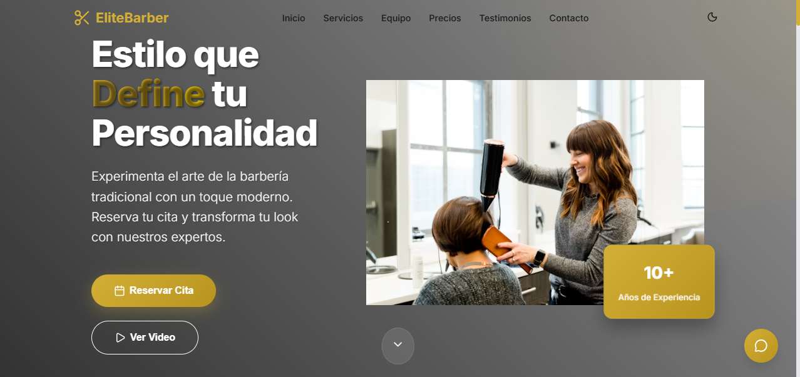

# 🧔 EliteBarber - Barbería Premium



Una moderna página web para barbería con diseño responsive, modo oscuro/claro y animaciones fluidas. Desarrollada con React Vite y Framer Motion.

## ✨ Características

- 🎨 **Diseño Moderno** - Interfaz elegante y profesional
- 🌙 **Modo Claro/Oscuro** - Alternar entre temas
- 📱 **Totalmente Responsive** - Optimizado para todos los dispositivos
- 🚀 **Rendimiento Optimizado** - Carga rápida con Vite
- 🎬 **Animaciones Fluidas** - Con Framer Motion
- ⚡ **Interactividad** - Efectos hover y micro-interacciones
- 🎯 **SEO Optimizado** - Estructura semántica

## 🛠️ Tecnologías Utilizadas

- **React 19** - Framework principal
- **Vite 7** - Build tool y dev server
- **Framer Motion** - Animaciones
- **Lucide React** - Iconografía
- **CSS Variables** - Sistema de diseño
- **CSS Grid & Flexbox** - Layout moderno

## 🌐 Demo en Vivo

👉 [https://frannkk-1994.github.io/barbershop-app](https://frannkk-1994.github.io/barbershop-app)

## 📦 Instalación y Uso

```bash
# Clonar repositorio
git clone https://github.com/Frannkk-1994/barbershop-app.git

# Navegar al directorio
cd barbershop-app

# Instalar dependencias
npm install

# Ejecutar en desarrollo
npm run dev

# Build para producción
npm run build

# Deploy en GitHub Pages
npm run deploy